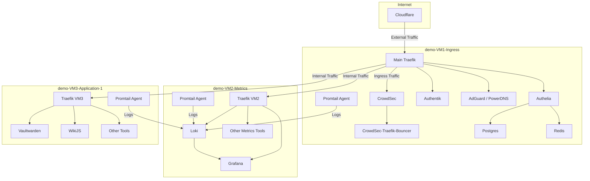

# 🏠 Ansible-Powered Secure Docker Compose Environment

## 🌟 Overview

This project provides a comprehensive, Ansible-automated setup for deploying a multi-VM environment with various containerized services. It's designed to create a robust, secure, and monitored infrastructure suitable for small to medium-sized applications, with a focus on flexible routing, independent operation of each VM, enhanced security, and unified logging.

## 🎯 Purpose

The main goals of this project are:

1. To provide an easily deployable, secure ingress point for web applications
2. To set up centralized authentication and DNS services
3. To establish a centralized logging and monitoring solution
4. To demonstrate best practices in containerized application deployment
5. To ensure each VM can operate independently while still being part of a cohesive system
6. To implement strong security measures across all components
7. To provide unified logging and metrics collection

## 🌟 Key Features

- **Ansible-Lint Compliant**: Ensures best practices in Ansible usage
- **Enhanced Security**: Implements userns-remap, non-root users for Docker containers, isolated networks, and auto-generated secrets
- **Centralized Logging and Metrics**: Uses Promtail and Loki for efficient log management and monitoring
- **Guided Proxmox Installation**: Manual setup with automated creation and installation of VMs and containers
- **Highly Customizable**: Ready to use out-of-the-box with predefined defaults that can be overridden at any time
- **Comprehensive Documentation**: Each role includes its own configuration and extensive comments for ease of customization and understanding
- **Modular Design**: Easily extendable for future services and applications

## 🏗 Architecture

The setup consists of three main Virtual Machines, each with its own Traefik instance and Promtail agent:

1. **demo-vm10-ingress**: Acts as the main entry point and security layer
   - Main Traefik: Primary reverse proxy, connected to Cloudflare
   - CrowdSec & CrowdSec-Traefik-Bouncer(Traefik-Plugin): Intrusion detection and prevention
   - Authelia & Authentik: Authentication services
   - AdGuard DNS services
   - Promtail Agent: Log collection

2. **demo-vm20-metrics**: Handles logging and monitoring
   - Traefik: Local reverse proxy for metrics services
   - Loki: Log aggregation system
   - Grafana: Visualization and monitoring
   - Other metrics tools
   - Promtail Agent: Log collection

3. **demo-vm31-application**: Hosts the actual applications
   - Traefik: Local reverse proxy for applications
   - Vaultwarden: Password manager
   - WikiJS: Wiki system
   - Other containerized applications
   - Promtail Agent: Log collection

The main Traefik instance on demo-vm10-ingress acts as the entrypoint for external traffic, routing requests to the appropriate VM based on the application. Each VM's local Traefik instance then handles internal routing to the specific services within that VM.

## 🔒 Security Measures

- User namespace remapping (userns-remap) is implemented by default, providing additional container isolation and further separating container users from host system users
- All Docker containers run as non-root users with specific UID:GID mappings, not associated with any existing users on the host system
- An Ansible role automatically generates strong passwords for various services (e.g., PostgreSQL, Redis, user accounts, JWT tokens) if not explicitly set, storing them in container-specific secret files
- Ansible playbooks follow ansible-lint best practices for secure and efficient configuration
- Docker secrets are utilized wherever possible to enhance security and manage sensitive information
(using vlans for separation)
(each docker group own network)

## 📊 Logging and Monitoring

- Each VM has its own Promtail agent for log collection
- All logs are forwarded to the centralized Loki instance on demo-vm20-metrics
- Grafana provides visualization and alerting based on the collected logs and metrics

## 🔀 Traffic Flow

1. External requests come through Cloudflare to the main Traefik instance on demo-vm10-ingress.
2. The main Traefik instance routes the traffic to the appropriate VM based on the requested application.
3. The local Traefik instance on the target VM then directs the traffic to the specific service.

This setup allows for:

- Centralized external access point and security
- Independent operation of each VM if needed
- Flexibility in routing and service management
- Comprehensive logging and monitoring across all services

## 🛠 Technologies Used

- Proxmox: As the virtualization platform
- Ansible: For automating the deployment and configuration
- Docker & Docker Compose: For containerization
- Traefik: For both main and local reverse proxying
- Promtail & Loki: For unified logging
- Grafana: For metrics visualization and alerting

## 📋 Prerequisites

- Server hardware capable of running Proxmox
- Network switch supporting VLANs (optional, but recommended)
- Basic understanding of Ansible, Docker, and networking
- Ansible installed on your control node
- SSH key pair for secure communication
- Cloudflare account for DNS management and additional security, including your own domain

## 🚀 Setup Guide

1. [Install and Configure Proxmox](Proxmox-Installation-Guide)
2. [Create Required VMs](VM-Creation-Guide)
3. [Configure Cloudflare](Cloudflare-Configuration)
4. [Clone and Prepare the Repository](Repository-Setup)
5. [Modify Ansible Inventory and Variables](Ansible-Configuration)
6. [Run Ansible Playbooks](Deployment-Guide)

For detailed instructions on each step, click the links above to visit the respective wiki pages.

## 🤝 Contributing

Contributions are welcome! Please read the [Contributing Guide](Contributing-Guide) for guidelines on how to submit changes.

## 📄 License

This project is licensed under the GPL-3.0 License - see the [LICENSE](License) file for details.

## 🙏 Acknowledgments

Community contributions and feedback are greatly appreciated.

For more detailed information on each component, please navigate through the wiki pages using the sidebar.
