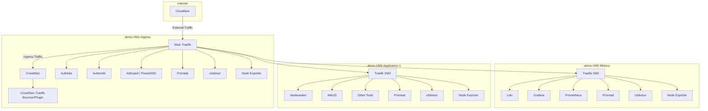

# 🏠 Ansible-Powered Secure Docker Compose Environment

## 🚧 Project Status Update 🚧
Ongoing code refactoring in progress. Working to transform the current architecture into a more modular, standardized, and efficient system. Committed to delivering a cleaner, more robust codebase.

## 📚 Table of Contents

- [Overview](#-overview)
- [Purpose](#-purpose)
- [Key Features](#-key-features)
- [Network Configuration](#-network-configuration)
- [Architecture](#-architecture)
- [Scalability and High Availability](#-scalability-and-high-availability)
- [Security Measures](#-security-measures)
- [Logging and Monitoring](#-logging-and-monitoring)
- [Traffic Flow](#-traffic-flow)
- [Technologies Used](#-technologies-used)
- [Prerequisites](#-prerequisites)
- [Getting Started](#-getting-started)
- [Contributing](#-contributing)
- [License](#-license)
- [Acknowledgments](#-acknowledgments)

## 🌟 Overview

This project provides a comprehensive, Ansible-automated setup for deploying a multi-VM environment with various containerized services. It's designed to create a robust, secure, and monitored infrastructure suitable for small to medium-sized applications, with a focus on flexible routing, independent operation of each VM, enhanced security, and unified logging.

## 🎯 Purpose

The main goals of this project are:

1. To provide an easily deployable, secure ingress point for web applications
2. To set up centralized authentication and DNS services
3. To establish a centralized logging and monitoring solution
4. To demonstrate best practices in containerized application deployment
5. To ensure each VM can operate independently while still being part of a cohesive system
6. To implement strong security measures across all components
7. To provide unified logging and metrics collection

## 🌟 Key Features

- **Ansible-Lint Compliant**: Ensures best practices in Ansible usage
- **Enhanced Security**: Implements userns-remap, non-root users for Docker containers, isolated networks, and auto-generated secrets
- **Centralized Logging and Metrics**: Uses Promtail and Loki for efficient log management and monitoring; integrates Prometheus, cAdvisor, and Node Exporter for comprehensive metrics and performance analysis
- **Guided Proxmox Installation**: Manual setup with automated creation and installation of VMs and containers
- **Highly Customizable**: Ready to use out-of-the-box with predefined defaults that can be overridden at any time
- **Comprehensive Documentation**: Each role includes its own configuration and extensive comments for ease of customization and understanding
- **Modular Design**: Easily extendable for future services and applications

## 🌐 Network Configuration

The network configuration for this setup involves both simple and advanced VLAN-based segmentation to ensure proper management and isolation of traffic.

### Router Configuration

- **Default Network**: 192.168.1.1/24
- **VLAN 5 (Management)**: 10.0.5.0/24
  - DHCP Range: 10.0.5.200 - 10.0.5.250
- **VLAN 90 (DMZ)**: 10.0.90.0/24
  - DHCP Range: 10.0.90.200 - 10.0.90.250

### Proxmox Network Setup

- **Simple Network**: Uses `eno1` with IP range 192.168.1.1/24.
- **Advanced Network**: Utilizes VLAN Trunk (5, 90) through `bond0`.
  - **Management VLAN (VLAN5MGMT)**: `vmbr5` with IP range 10.0.5.10/24
  - **DMZ VLAN (VLAN90DMZ)**: `vmbr90` with IP range 10.0.90.10/24

### Virtual Machines

- **demo-VM1-Ingress**: Connected to `vmbr0` or `vmbr90`
- **demo-VM2-Metrics**: Connected to `vmbr0` or `vmbr90`
- **demo-VM3-Application-1**: Connected to `vmbr0` or `vmbr90`

This guide uses the advanced method, ensuring efficient management, security, and isolation of different types of network traffic across the virtual machines.

## 🏗 Architecture

The setup consists of three main Virtual Machines, each with its own Traefik instance and Promtail agent:

1. **demo-vm10-ingress**: Acts as the main entry point and security layer
   - Main Traefik: Primary reverse proxy, connected to Cloudflare
   - CrowdSec & CrowdSec-Traefik-Bouncer (Traefik-Plugin): Intrusion detection and prevention
   - Authelia & Authentik: Authentication services
   - AdGuard DNS services
   - Promtail: Log collection
   - cAdvisor: Resource usage and performance analysis
   - Node Exporter: Hardware and OS metrics exporter
   - Webmin: Web-based interface for managing Unix systems

2. **demo-vm20-metrics**: Handles logging, monitoring, and metrics collection
   - Traefik: Local reverse proxy for metrics services
   - Grafana: Visualization and monitoring
   - Loki: Log aggregation system
   - Prometheus: Metrics collection and alerting
   - Promtail: Log collection
   - cAdvisor: Resource usage and performance analysis
   - Node Exporter: Hardware and OS metrics exporter
   - Webmin: Web-based interface for managing Unix systems

3. **demo-vm31-application**: Hosts the actual applications
   - Traefik: Local reverse proxy for applications
   - Vaultwarden: Password manager
   - WikiJS: Wiki system
   - Other containerized applications
   - Promtail: Log collection
   - cAdvisor: Resource usage and performance analysis
   - Node Exporter: Hardware and OS metrics exporter
   - Webmin: Web-based interface for managing Unix systems

The main Traefik instance on demo-vm10-ingress acts as the entry point for external traffic, routing requests to the appropriate VM based on the application. Each VM's local Traefik instance then handles internal routing to the specific services within that VM.

## 🚀 Scalability and High Availability

### 🔍 Evaluation and Decision-Making Process

After extensive evaluation and years of hands-on testing, a decision was made to prioritize simplicity and control over complexity. Kubernetes, while powerful and widely adopted in large-scale environments, introduces a level of complexity that may not be necessary or desirable for a homelab or small business setup.

#### **Why Not Kubernetes?**

- **Complexity**: Kubernetes is a complex system that often requires a steep learning curve and intricate management. For someone who prefers to maintain a deep understanding of the entire stack and where to troubleshoot when issues arise, this complexity can be a significant drawback.
  
- **Resource Requirements**: Running Kubernetes, even with lightweight distributions like k3s or solutions like Rancher, demands considerable resources. Maintaining a minimal Kubernetes cluster typically requires at least three nodes to avoid split-brain issues, further complicating the setup and increasing overhead.

- **Control**: The desire for control over every aspect of the infrastructure led to a preference for Docker and Docker Compose. Docker provides a more straightforward approach, enabling fine-grained control over container behavior, networking, and resource allocation without the overhead of managing a full-fledged orchestration system.

- **High Availability Concerns**: While tools like kube-vip and MetalLB can help achieve high availability in Kubernetes clusters, they also add to the complexity and potential points of failure. In contrast, a simpler setup using Proxmox with Docker allows for effective management of resources without the need for complex orchestration layers.

### 🛠 Why Docker and Not Kubernetes?

- **Simplicity**: Docker, paired with Docker Compose, offers a straightforward, well-understood environment that aligns well with the needs of a homelab. It supports the rapid deployment of containerized applications while keeping the infrastructure simple and manageable.

- **Resource Efficiency**: Docker is less resource-intensive compared to Kubernetes. This makes it a more suitable choice for environments with limited resources, such as a homelab or small business.

- **Ease of Backup and Recovery**: Using Proxmox Backup Server (PBS) and RAID for persistent data storage simplifies backup and recovery processes. Snapshots can be created frequently, and persistent data is stored securely, reducing downtime and ensuring quick recovery in case of failure.

- **Minimized Downtime**: Docker's simplicity and Proxmox's robust snapshot capabilities allow for minimal downtime. Even in scenarios where the system experiences issues, recovery is straightforward, and the impact on the overall infrastructure is minimized.

### 🗂 Considerations for High Availability

While the current setup is designed to be straightforward and manageable without the complexities of clustering, it remains flexible enough to be extended into a high-availability (HA) architecture if needed in the future:

- **Single Node Simplicity**: The current approach avoids the complexities and potential pitfalls of clustering, reducing points of failure and ensuring that each component is easy to manage and troubleshoot.

- **Proxmox Cluster**: In scenarios where clustering might be considered, a minimal Proxmox cluster with two nodes supplemented by an additional quorum device (e.g., a Raspberry Pi) can help minimize potential points of failure. However, quorum loss remains a critical concern, which is why a simpler, more controllable single-node setup is currently favored.

- **Potential for High Availability**: Despite not using a cluster, this setup is designed with future expansion in mind. For instance:
  - **PostgreSQL Database**: The setup can be extended to include a highly available PostgreSQL database cluster. By deploying additional VMs with replicated PostgreSQL instances, you can achieve database redundancy and failover capabilities without rearchitecting the entire system.
  - **Shared Storage**: Shared storage solutions like NFS, GlusterFS, or Ceph can be added across multiple VMs to ensure persistent data is accessible and resilient, supporting HA without a significant overhaul. Ceph, in particular, can provide highly available and scalable storage that integrates well with Proxmox.
  - **Load Balancing with MetalLB and kube-vip**: Tools such as MetalLB and kube-vip, often used in Kubernetes environments, can be utilized independently to provide load balancing and IP failover. This enables HA capabilities for your services by distributing traffic across multiple VMs.
  - **Proxmox Multi-Cluster Setup**: Proxmox can be expanded into a multi-cluster environment later on if desired. This allows for greater scalability and redundancy, ensuring that resources can be balanced across multiple nodes and that the infrastructure can recover from node failures without service disruption.

- **Scalability and Flexibility**: The current setup allows for future enhancements without the need to redo everything from scratch. Whether you need to add more VMs, implement HA databases, introduce load balancing, or expand to a Proxmox multi-cluster, the infrastructure is flexible enough to support these upgrades incrementally.

In conclusion, while the initial focus is on simplicity and control, the design allows for easy expansion into a high-availability architecture if and when your requirements evolve. This ensures that you can scale and enhance your infrastructure without the need for a complete rebuild.

## 🔒 Security Measures

- User namespace remapping (userns-remap) is implemented by default, providing additional container isolation and further separating container users from host system users
- Webmin access is secured by Traefik's HTTPS enforcement, utilizing Cloudflare for additional protection. Traefik's routing ensures that Webmin is accessible only via the defined routes, protecting the web GUI from unauthorized access.
- All Docker containers run as non-root users with specific UID:GID mappings, not associated with any existing users on the host system
- An Ansible role automatically generates strong passwords for various services (e.g., PostgreSQL, Redis, user accounts, JWT tokens) if not explicitly set, storing them in container-specific secret files
- Ansible playbooks follow ansible-lint best practices for secure and efficient configuration
- Docker secrets are utilized wherever possible to enhance security and manage sensitive information
(using vlans for separation)
(each docker group own network)

## 📊 Logging and Monitoring

- Each VM has its own Promtail agent for log collection
- All logs are forwarded to the centralized Loki instance on demo-vm20-metrics
- Grafana provides visualization and alerting based on the collected logs and metrics

## 🔀 Traffic Flow

1. External requests come through Cloudflare to the main Traefik instance on demo-vm10-ingress.
2. The main Traefik instance routes the traffic to the appropriate VM based on the requested application.
3. The local Traefik instance on the target VM then directs the traffic to the specific service.

This setup allows for:

- Centralized external access point and security
- Independent operation of each VM if needed
- Flexibility in routing and service management
- Comprehensive logging and monitoring across all services

## 🛠 Technologies Used

- **Proxmox**: As the virtualization platform
- **Ansible**: For automating the deployment and configuration
- **Docker & Docker Compose**: For containerization
- **Traefik**: For both main and local reverse proxying
- **Promtail & Loki**: For unified logging
- **Grafana**: For metrics visualization and alerting
- **Prometheus**: A time-series database and monitoring system that collects and stores metrics, allowing for detailed performance analysis and alerting on resource thresholds.
- **cAdvisor**: A container monitoring solution that provides insights into resource usage and performance at the container level, integrated with Prometheus for detailed metrics.
- **Node Exporter**: A Prometheus exporter that collects hardware and OS-level metrics from the virtual machines, contributing to a comprehensive monitoring setup.
- **Webmin**: For web-based system administration

## 📋 Prerequisites

- Server hardware capable of running Proxmox
- Network switch supporting VLANs (optional, but recommended)
- Basic understanding of Ansible, Docker, and networking
- Ansible installed on your control node
- SSH key pair for secure communication
- Cloudflare account for DNS management and additional security, including your own domain

## 🚀 Getting Started

For detailed setup instructions, please visit the [Wiki](https://github.com/n0one42/ansible-homelab/wiki).

## 🤝 Contributing

Contributions are welcome! Please read the [Contributing Guide] for guidelines on how to submit changes.

## 📄 License

This project is licensed under the GPL-3.0 License - see the [LICENSE](https://github.com/n0one42/ansible-homelab?tab=GPL-3.0-1-ov-file#readme) file for details.

## 🙏 Acknowledgments

Community contributions and feedback are greatly appreciated.

For more detailed information on each component, please navigate through the wiki pages using the sidebar.

## Notes

- What's Up Docker (WUD)
- Graylog
- Watchtower
- WikiJs
- Vaultwarden
- Elasticsearch
- Zabbix
- Guacamole Server
- Homepage
- GitLab
- OpnSense & ZenArmor (Sensei)
- Webmin
